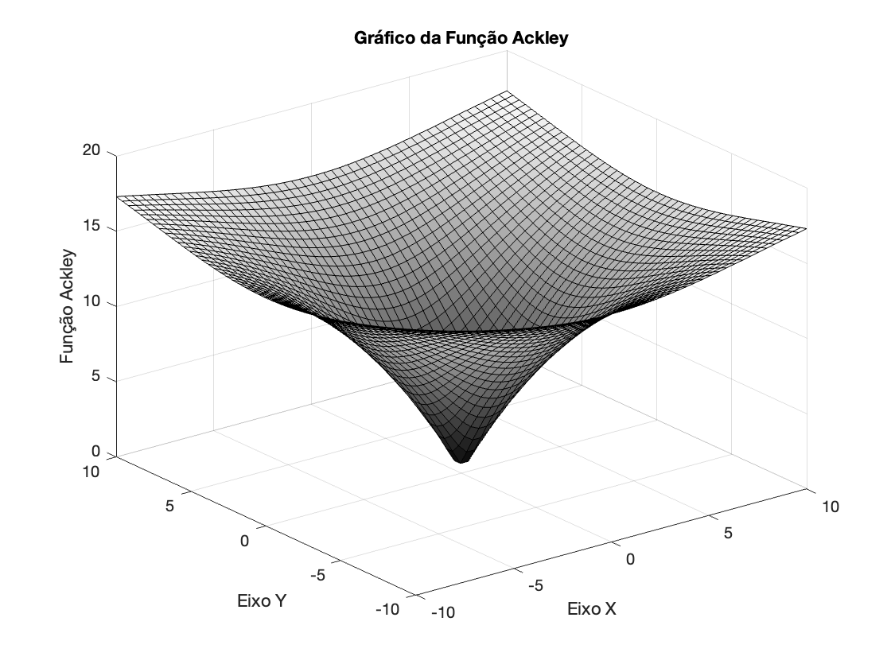

# Algoritmo Genético para função Ackley

O projeto foi criado no decorrer da disciplina de Inteligência Computacional do curso de Engenharia de Computação da Universidade Federal do Ceará (Campus Sobral) e se trata de uma implementação simples de Algoritmos genéticos para achar o mínimo da **Função Ackey**

$$ f(x,y) = -20\exp{ [ -0.2 \sqrt{ 0.5( x^2 + y^2 ) } ] } -\exp{ [ 0.5( \cos{ 2\pi x} + \cos{2 \pi y} ) ] } + \exp{ (1) } + 20 $$

No intervalo $x$ $\in$ $[-10,10]$ e $y$ $\in$ $[-10,10]$.

## Requisitos

  - [X] `Requisito 01`: Encontrar o mínimo da função no intervalo $x$ $\in$ $[-10,10]$ e $y$ $\in$ $[-10,10]$;
  - [X] `Requisito 02`: O programa deverá efetuar a seleção dos pais por meio do **método da roleta**;
  - [ ] `Requisito 03`: A cada geração, o algoritmo deverá exibir:
    - [ ] Nota média de avaliação da população
    - [ ] Nota do pior indivíduo (com a percentagens de roleta)
    - [ ] Nota do melhor indivíduo (com a percentagens de roleta)
  - [ ] Cada indivíduo da população deve ser um vetor binário de `40 bits`
    - [ ] Os vinte primeiros representam $x$
    - [ ] Os vinte últimos representam $y$
  - [ ] Exibir os valores $x$ e $y$ do menor valor encontrado para $f(x, y)$

 ## Autores

<table>
  <tr>
    <td align="center">
      <a href="https://github.com/MarianaTc18" target="_blank">
        
         
        Mariana Texeira
      </a>
    </td>
    <td align="center">
      <a href="https://github.com/rob-ec" target="_blank">
        
         
        Robson Gomes
      </a>
    </td>
</table>
